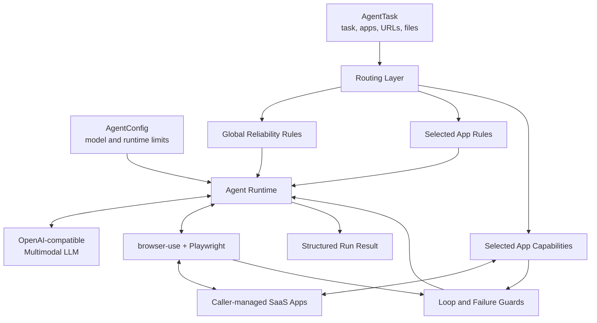

# Intelligence Indeed Agent

English | [简体中文](README.zh-CN.md)

[](https://www.python.org/)
[](LICENSE)
[](CHANGELOG.md)

Intelligence Indeed Agent is a standalone browser-agent framework for
long-horizon, multi-application SaaS tasks. It is built on browser-use and adds
app-aware prompt routing, optional deterministic app capabilities, bounded
failure recovery, and structured runtime observability.

## Overview

Long-running SaaS workflows fail for reasons that cannot be solved by a stronger
model alone. An agent may lose task state while switching applications,
repeatedly click an unresponsive control, mistake an apparently successful UI
transition for a durable write, or spend most of its step budget on one blocked
interaction.

Intelligence Indeed Agent adds multiple layers of reliability mechanisms around
a multimodal browser agent.

The framework can be embedded in a benchmark harness, product workflow, or
custom orchestration service without importing the lifecycle of any particular
benchmark.

## System Architecture



The caller owns application deployment, network policy, credentials, browser
prerequisites, and evaluation. The agent is responsible for executing one task.

## Quick Start

### Installation

Python 3.11 or newer is required.

```bash
git clone <your-repository-url>
cd intelligence-indeed-agent
python -m venv .venv
source .venv/bin/activate
python -m pip install -e ".[dev]"
python -m playwright install chromium
```

On Windows, activate the environment with `.venv\Scripts\activate`.

Use `.env.example` as a configuration template, then export the corresponding
variables or load them with your own environment manager. The package does not
load `.env` automatically.

```bash
export SAAS_AGENT_LLM_BASE_URL="https://provider.example/v1"
export SAAS_AGENT_LLM_API_KEY="replace-me"
export SAAS_AGENT_LLM_MODEL="model-name"
```

For migration, `AgentConfig.from_env()` still accepts the legacy
`LLM_BASE_URL`, `LLM_API_KEY`, and `LLM_MODEL` variables. New integrations
should use the `SAAS_AGENT_` prefix.

### Run a Task from the CLI

Create a YAML or JSON task manifest:

```yaml
task_id: customer-import
prompt: |
  Create a Customers table with Name and Email fields.
apps: [baserow]
app_urls:
  baserow: http://127.0.0.1:8001
input_files: []
```

Run the task:

```bash
intelligence-indeed-agent examples/task.example.yaml \
  --output run-output/example.result.json
```

Common options:

```text
--context PATH       Optional capability connection context YAML/JSON
--output PATH        Optional result JSON path
--model NAME         Override SAAS_AGENT_LLM_MODEL
--max-steps N        Override the step budget
--prompt-mode MODE   off, routing_trimmed, or routing_bucket
--tool-mode MODE     disabled or routing
--show-browser       Run with a visible browser
```

### Run from Python

```python
import asyncio

from saas_agent import AgentConfig, AgentTask, run_agent

task = AgentTask(
    task_id="customer-import",
    prompt="Create a Customers table with the supplied rows.",
    apps=("baserow",),
    app_urls={"baserow": "http://127.0.0.1:8001"},
)

config = AgentConfig.from_env(
    max_steps=120,
    prompt_mode="routing_trimmed",
    tool_mode="disabled",
)

result = asyncio.run(
    run_agent(task, config, output_path="run-output/result.json")
)
print(result["status"])
```

`run_agent()` returns a JSON-serializable dictionary. It executes the task but
does not assign a benchmark score.

## Configuration Reference

| Variable | Default | Purpose |
|---|---:|---|
| `SAAS_AGENT_MAX_STEPS` | `80` | Maximum agent iterations |
| `SAAS_AGENT_LLM_API_TIMEOUT` | `600` | Provider request timeout in seconds |
| `SAAS_AGENT_LLM_STEP_TIMEOUT` | `150` | Per-step timeout in seconds |
| `SAAS_AGENT_LLM_MAX_COMPLETION_TOKENS` | `8192` | Completion token ceiling |
| `SAAS_AGENT_PROMPT_MODE` | `routing_trimmed` | Prompt routing profile |
| `SAAS_AGENT_TOOL_MODE` | `disabled` | App capability routing profile |
| `SAAS_AGENT_LOOP_GUARD` | `warn` | Repeated-action policy |

See `.env.example` for all supported environment variables.

## Directory Structure

```text
intelligence-indeed-agent/
|-- src/saas_agent/
|   |-- agent.py                 # LLM adapter and browser-agent runtime
|   |-- models.py                # Public task and runtime configuration
|   |-- prompt_routes.py         # Global and app prompt routing
|   |-- tool_routes.py           # App capability selection and registration
|   |-- loop_guard.py            # Repeated-action detection
|   |-- termination.py           # Termination classification
|   `-- *_helper.py              # Optional deterministic app capabilities
|-- examples/task.example.yaml  # Example task manifest
|-- tests/                       # Unit and public-boundary tests
|-- scripts/audit_public_tree.py # Secret and release-artifact audit
`-- pyproject.toml               # Package and CLI definition
```

The distribution does not include a task dataset, application deployment,
benchmark runner, or evaluator.

## Provenance

The runtime was extracted from reliability work built on the Apache-2.0
[SaaS-Bench](https://github.com/UniPat-AI/SaaS-Bench) project. This is an
independent agent library, not the official SaaS-Bench repository. Exact source
commits and extraction boundaries are recorded in `SOURCE_PROVENANCE.json` and
`NOTICE`.

## License

This project is licensed under the Apache License 2.0. See `LICENSE`.
