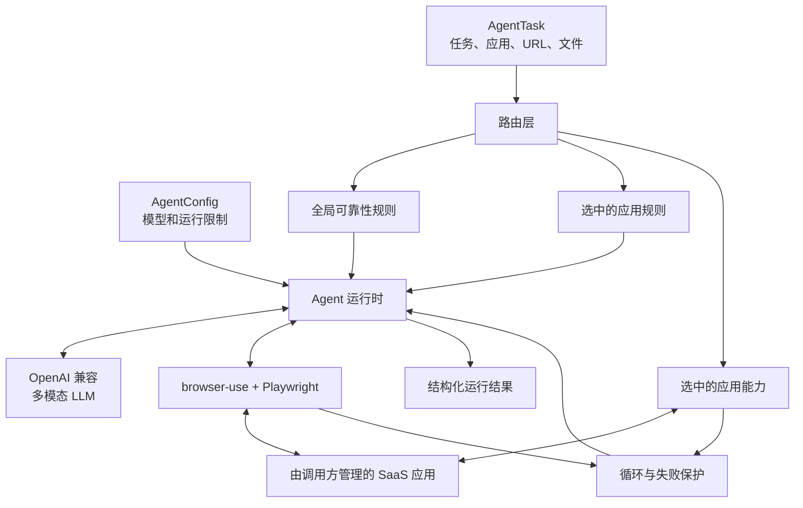

# Intelligence Indeed Agent

[English](README.md) | 简体中文

[](https://www.python.org/)
[](LICENSE)
[](CHANGELOG.md)

Intelligence Indeed Agent 是一个面向长流程、多应用 SaaS 任务的独立浏览器 Agent
框架。它基于 browser-use，并加入了应用感知的 Prompt 路由、可选的确定性应用
能力、有界失败恢复和结构化运行观测。

## 概览

长流程 SaaS 工作失败的原因，并不只是模型能力不够强。Agent 可能在切换应用时
丢失任务状态，反复点击一个没有响应的控件，把看起来成功的 UI 跳转误认为数据
已经持久化，或者把大部分步数预算耗在一个受阻的交互上。

Intelligence Indeed Agent 在多模态浏览器 Agent 外增加了多层可靠性机制。

该框架可以被嵌入 Benchmark Harness、产品工作流或自定义编排服务，同时不引入
任何特定 Benchmark 的生命周期逻辑。


## 系统架构



调用方负责应用部署、网络策略、凭证、浏览器依赖和评测；Agent 负责执行单个任务。

## 快速开始

### 安装

需要 Python 3.11 或更高版本。

```bash
git clone <your-repository-url>
cd intelligence-indeed-agent
python -m venv .venv
source .venv/bin/activate
python -m pip install -e ".[dev]"
python -m playwright install chromium
```

Windows 下使用 `.venv\Scripts\activate` 激活环境。

请将 `.env.example` 作为配置模板，然后导出对应环境变量，或使用自己的环境变量
管理工具加载。该包不会自动加载 `.env`。

```bash
export SAAS_AGENT_LLM_BASE_URL="https://provider.example/v1"
export SAAS_AGENT_LLM_API_KEY="replace-me"
export SAAS_AGENT_LLM_MODEL="model-name"
```

为便于迁移，`AgentConfig.from_env()` 仍兼容旧变量 `LLM_BASE_URL`、`LLM_API_KEY`
和 `LLM_MODEL`，但新集成应使用 `SAAS_AGENT_` 前缀。

### 通过 CLI 运行任务

创建一个 YAML 或 JSON 任务清单：

```yaml
task_id: customer-import
prompt: |
  Create a Customers table with Name and Email fields.
apps: [baserow]
app_urls:
  baserow: http://127.0.0.1:8001
input_files: []
```

运行任务：

```bash
intelligence-indeed-agent examples/task.example.yaml \
  --output run-output/example.result.json
```

常用选项：

```text
--context PATH       Optional capability connection context YAML/JSON
--output PATH        Optional result JSON path
--model NAME         Override SAAS_AGENT_LLM_MODEL
--max-steps N        Override the step budget
--prompt-mode MODE   off, routing_trimmed, or routing_bucket
--tool-mode MODE     disabled or routing
--show-browser       Run with a visible browser
```

### 通过 Python 运行

```python
import asyncio

from saas_agent import AgentConfig, AgentTask, run_agent

task = AgentTask(
    task_id="customer-import",
    prompt="Create a Customers table with the supplied rows.",
    apps=("baserow",),
    app_urls={"baserow": "http://127.0.0.1:8001"},
)

config = AgentConfig.from_env(
    max_steps=120,
    prompt_mode="routing_trimmed",
    tool_mode="disabled",
)

result = asyncio.run(
    run_agent(task, config, output_path="run-output/result.json")
)
print(result["status"])
```

`run_agent()` 返回一个可 JSON 序列化的字典。它执行任务，但不会给出 Benchmark
分数。


## 配置参考

| 变量 | 默认值 | 用途 |
|---|---:|---|
| `SAAS_AGENT_MAX_STEPS` | `80` | Agent 最大迭代步数 |
| `SAAS_AGENT_LLM_API_TIMEOUT` | `600` | 服务商请求超时，单位为秒 |
| `SAAS_AGENT_LLM_STEP_TIMEOUT` | `150` | 单步超时，单位为秒 |
| `SAAS_AGENT_LLM_MAX_COMPLETION_TOKENS` | `8192` | 单次输出 Token 上限 |
| `SAAS_AGENT_PROMPT_MODE` | `routing_trimmed` | Prompt 路由模式 |
| `SAAS_AGENT_TOOL_MODE` | `disabled` | 应用能力路由模式 |
| `SAAS_AGENT_LOOP_GUARD` | `warn` | 重复操作处理策略 |

所有支持的环境变量请查看 `.env.example`。

## 目录结构

```text
intelligence-indeed-agent/
|-- src/saas_agent/
|   |-- agent.py                 # LLM 适配器和浏览器 Agent 运行时
|   |-- models.py                # 公开任务与运行配置
|   |-- prompt_routes.py         # 全局及应用 Prompt 路由
|   |-- tool_routes.py           # 应用能力选择和注册
|   |-- loop_guard.py            # 重复操作检测
|   |-- termination.py           # 终止原因分类
|   `-- *_helper.py              # 可选的确定性应用能力
|-- examples/task.example.yaml  # 示例任务清单
|-- tests/                       # 单元测试与公开边界测试
|-- scripts/audit_public_tree.py # 密钥与发布产物审计
`-- pyproject.toml               # 包与 CLI 定义
```

发布包中不包含任务数据集、应用部署、Benchmark Runner 或 Evaluator。


## 来源说明

该运行时从基于 Apache-2.0 许可的
[SaaS-Bench](https://github.com/UniPat-AI/SaaS-Bench) 可靠性改进工作中抽离而来。
这是一个独立 Agent 库，不是 SaaS-Bench 官方仓库。具体来源 Commit 和抽离边界
记录在 `SOURCE_PROVENANCE.json` 与 `NOTICE` 中。

## 许可证

本项目使用 Apache License 2.0，详见 `LICENSE`。
